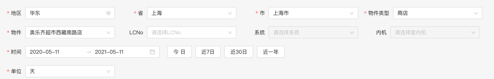
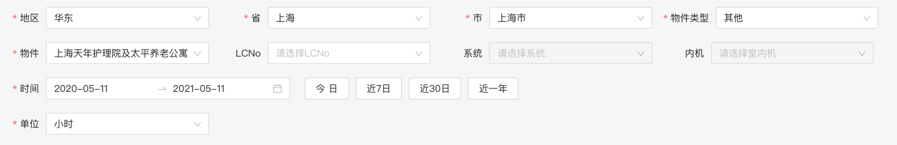
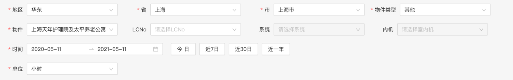

# 商用数据统计平台

#### 整体概况
- 默认展示时间 当前日期-一年 ~ 当前日期，一年内有数据

#### 在线数量统计分析 单
- 时间单位仅可选天，待接口完善
  /report/query/commerce/v1/national/getDeviceOnlineNumInfo

#### 电力消耗统计 单
- 时间单位仅可选天，待接口完善
  /report/query/commerce/v1/device/getElectricConsume
- 此条件下有数据
  
  ````
  {"regionCode":"10","provinceCode":"310000","cityCode":"310100","buildingType":"A1","buildingId":2475,"timeType":"day","beginTime":"2020-05-11","endTime":"2021-05-11","type":0}
  ````
  
#### 电力消耗统计 多
- 时间单位仅可选天，待接口完善，有数据的物件同单对象
  /report/query/commerce/v1/device/getCompareElectricConsume


#### 运转时间统计 单
- 时间单位仅可选 小时，待接口完善
- 此条件下有数据


#### 运转时间统计 多
同上

#### 设定温度、回风温度以及耗电量统计 单
- 时间单位仅可选 小时，待接口完善
- 此条件下有数据


#### 设定温度、回风温度以及耗电量统计 多
同上